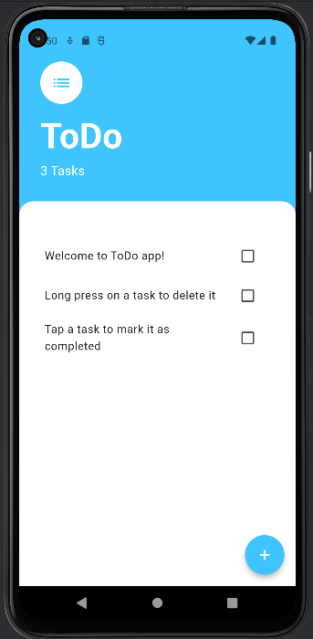
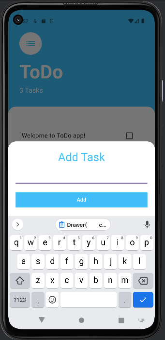

# Todo App

A simple ToDo app built with Flutter, allowing users to manage their tasks efficiently.

## Features
- Add tasks with a simple and intuitive interface.
- Mark tasks as completed or incomplete.
- Keep track of the total number of tasks.
- Seamless integration with Flutter's material design.
- Long press on a task to delete it.

## Screenshots



*Caption: Tasks Screen - "View and manage your tasks in a clean and organized interface."*




*Caption: Add Task Screen - "Easily add new tasks to your to-do list with a user-friendly interface."*

## Getting Started

To run this app locally, follow these steps:

1. Clone this repository:
   ```bash
   git clone https://github.com/kshubham767/ToDo_App.git

2. Navigate to the project directory:
    ```bash
   cd ToDo_App
3. Install dependencies:
   Make sure to check and update the dependencies in the pubspec.yaml file
   ```bash
    flutter pub get

4. Run the app:
    ```bash
   flutter run

## Dependencies
This project uses the following Flutter packages:
- provider: ^6.1.1: A state management library for Flutter applications.

## Contributing
If you'd like to contribute to the development of the ToDo App, feel free to:

- Submit pull requests
- Open issues on the GitHub repository

## License
This project is licensed under the MIT License. See the [LICENSE](https://opensource.org/licenses/MIT) file for details.

## Contact
For any questions or feedback, please contact the project maintainer at kshubham767@gmail.com.
